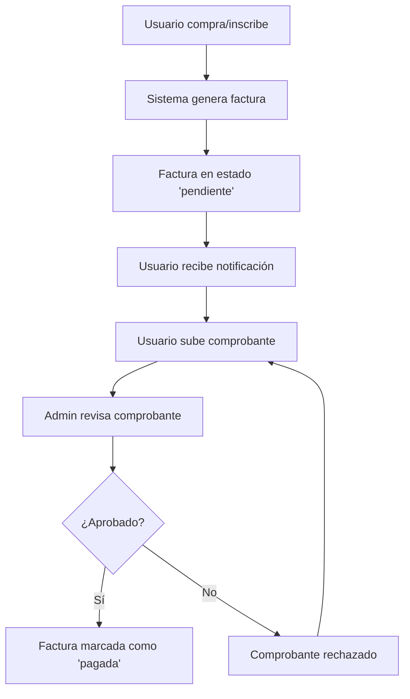

# Sistema de Facturas - Rifas Anica

## 📋 Descripción General

El sistema de facturas de Rifas Anica permite gestionar de manera integral todas las transacciones financieras relacionadas con rifas, sanes y otros servicios. Proporciona un flujo completo desde la generación de facturas hasta la confirmación de pagos.

## 🏗️ Arquitectura del Sistema

### Modelos Principales

#### 1. Factura
```python
class Factura(models.Model):
    usuario = models.ForeignKey(User, on_delete=models.CASCADE)
    concepto = models.CharField(max_length=255)
    monto = models.DecimalField(max_digits=10, decimal_places=2)
    tipo = models.CharField(max_length=20, choices=TIPOS_CHOICES)
    estado = models.CharField(max_length=20, choices=ESTADOS_CHOICES)
    fecha_emision = models.DateTimeField(auto_now_add=True)
    fecha_vencimiento = models.DateTimeField(null=True, blank=True)
    fecha_pago = models.DateTimeField(null=True, blank=True)
    rifa = models.ForeignKey(Rifa, null=True, blank=True, on_delete=models.SET_NULL)
    san = models.ForeignKey(San, null=True, blank=True, on_delete=models.SET_NULL)
    archivo = models.FileField(upload_to='facturas/', null=True, blank=True)
    notas = models.TextField(blank=True)
```

#### 2. ComprobantePago
```python
class ComprobantePago(models.Model):
    factura = models.ForeignKey(Factura, on_delete=models.CASCADE, related_name='comprobantes')
    archivo = models.FileField(upload_to='comprobantes/')
    metodo_pago = models.CharField(max_length=20, choices=METODOS_PAGO_CHOICES)
    fecha_pago = models.DateField()
    monto_pagado = models.DecimalField(max_digits=10, decimal_places=2)
    numero_referencia = models.CharField(max_length=100, blank=True)
    estado = models.CharField(max_length=20, choices=ESTADOS_COMPROBANTE_CHOICES, default='pendiente')
    notas = models.TextField(blank=True)
    fecha_subida = models.DateTimeField(auto_now_add=True)
```

### Estados de Facturas

- **pendiente**: Factura generada, pendiente de pago
- **pagada**: Factura pagada y confirmada
- **vencida**: Factura con fecha de vencimiento superada
- **cancelada**: Factura cancelada por el usuario o administrador

### Estados de Comprobantes

- **pendiente**: Comprobante subido, pendiente de revisión
- **aprobado**: Comprobante verificado y aprobado
- **rechazado**: Comprobante rechazado por el administrador

## 🚀 Funcionalidades Principales

### 1. Gestión de Facturas

#### Lista de Facturas (`factura_list`)
- **URL**: `/facturas/`
- **Vista**: `FacturaListView`
- **Funcionalidades**:
  - Lista paginada de todas las facturas del usuario
  - Filtros por tipo, estado y fecha
  - Estadísticas en tiempo real
  - Acciones rápidas (ver, pagar, descargar)

#### Detalle de Factura (`factura_detail`)
- **URL**: `/facturas/<int:pk>/`
- **Vista**: `FacturaDetailView`
- **Funcionalidades**:
  - Información completa de la factura
  - Historial de comprobantes
  - Acciones de pago para facturas pendientes
  - Enlaces a elementos relacionados (rifas/sanes)

### 2. Sistema de Comprobantes

#### Subir Comprobante (`subir_comprobante_factura`)
- **URL**: `/facturas/<int:factura_id>/subir-comprobante/`
- **Vista**: `subir_comprobante_factura`
- **Funcionalidades**:
  - Formulario de carga de comprobantes
  - Validación de archivos (JPG, PNG, PDF)
  - Drag & drop para subida de archivos
  - Información detallada del pago
  - Historial de comprobantes anteriores

### 3. Administración

#### Gestión de Pagos
- **Confirmar Pago**: `/admin/pagos/<int:factura_id>/confirmar/`
- **Rechazar Pago**: `/admin/pagos/<int:factura_id>/rechazar/`

## 🎨 Interfaz de Usuario

### Diseño Responsivo
- **Desktop**: Layout completo con sidebar y estadísticas
- **Mobile**: Diseño adaptativo con navegación optimizada
- **Tablet**: Layout intermedio con funcionalidades completas

### Componentes UI
- **Cards de Estadísticas**: Resumen visual de facturas
- **Tablas Interactivas**: Lista de facturas con acciones
- **Formularios Modernos**: Subida de comprobantes con validación
- **Notificaciones**: Mensajes de éxito/error en tiempo real

### Colores y Estilos
```css
/* Paleta de colores */
--primary: #e92932;      /* Rojo principal */
--secondary: #994d51;    /* Rojo secundario */
--accent: #f3e7e8;       /* Rosa claro */
--dark: #1b0e0e;         /* Negro */
--light: #fcf8f8;        /* Blanco */
```

## 🔧 Configuración y Uso

### 1. Instalación

```bash
# Clonar el repositorio
git clone <repository-url>
cd sanes_project

# Instalar dependencias
pip install -r requirements.txt

# Configurar base de datos
python manage.py makemigrations
python manage.py migrate

# Crear superusuario
python manage.py createsuperuser
```

### 2. Configuración de Archivos

```python
# settings.py
MEDIA_URL = '/media/'
MEDIA_ROOT = os.path.join(BASE_DIR, 'media')

# Configurar almacenamiento de archivos
DEFAULT_FILE_STORAGE = 'django.core.files.storage.FileSystemStorage'
```

### 3. Pruebas del Sistema

```bash
# Crear datos de prueba
python test_facturas.py crear

# Ver estadísticas
python test_facturas.py estadisticas

# Limpiar datos de prueba
python test_facturas.py limpiar

# Ejecutar pruebas completas
python test_facturas.py completo
```

## 📊 Flujo de Trabajo

### 1. Generación de Facturas



### 2. Gestión de Pagos

1. **Usuario sube comprobante**
   - Selecciona archivo (JPG, PNG, PDF)
   - Completa información del pago
   - Sistema valida formato y tamaño

2. **Administrador revisa**
   - Accede al panel de administración
   - Verifica comprobante y monto
   - Aprueba o rechaza el pago

3. **Sistema actualiza estado**
   - Si aprobado: factura → 'pagada'
   - Si rechazado: comprobante → 'rechazado'

## 🔒 Seguridad

### Validaciones
- **Archivos**: Solo JPG, PNG, PDF hasta 10MB
- **Montos**: Validación de decimales y rangos
- **Fechas**: Validación de fechas lógicas
- **Usuarios**: Solo propietarios pueden ver sus facturas

### Permisos
- **Usuarios**: Ver y gestionar sus propias facturas
- **Administradores**: Acceso completo al sistema
- **Anónimos**: Solo acceso a información pública

## 📈 Reportes y Estadísticas

### Métricas Disponibles
- Total de facturas por estado
- Monto total facturado
- Facturas por tipo (rifas, sanes, otros)
- Comprobantes por estado
- Rendimiento por período

### Exportación
- **PDF**: Reportes detallados
- **Excel**: Datos tabulares
- **API**: Integración con sistemas externos

## 🐛 Solución de Problemas

### Problemas Comunes

1. **Error al subir archivo**
   - Verificar formato (JPG, PNG, PDF)
   - Verificar tamaño (máximo 10MB)
   - Verificar permisos de carpeta media/

2. **Factura no aparece**
   - Verificar que el usuario esté autenticado
   - Verificar filtros aplicados
   - Verificar permisos de usuario

3. **Comprobante no se aprueba**
   - Verificar que el monto coincida
   - Verificar que la fecha sea válida
   - Contactar al administrador

### Logs y Debugging

```python
# Habilitar logs detallados
LOGGING = {
    'version': 1,
    'disable_existing_loggers': False,
    'handlers': {
        'file': {
            'level': 'DEBUG',
            'class': 'logging.FileHandler',
            'filename': 'debug.log',
        },
    },
    'loggers': {
        'sanes.views': {
            'handlers': ['file'],
            'level': 'DEBUG',
            'propagate': True,
        },
    },
}
```

## 🔄 Mantenimiento

### Tareas Programadas

1. **Verificación de facturas vencidas**
   ```python
   # management/commands/check_expired_invoices.py
   python manage.py check_expired_invoices
   ```

2. **Limpieza de archivos temporales**
   ```python
   # management/commands/cleanup_temp_files.py
   python manage.py cleanup_temp_files
   ```

3. **Backup de datos**
   ```bash
   python manage.py dumpdata sanes.Factura > facturas_backup.json
   ```

### Actualizaciones

1. **Migraciones de base de datos**
   ```bash
   python manage.py makemigrations
   python manage.py migrate
   ```

2. **Actualización de dependencias**
   ```bash
   pip install -r requirements.txt --upgrade
   ```

## 📞 Soporte

### Contacto
- **Email**: soporte@rifasanica.com
- **Documentación**: [docs.rifasanica.com](https://docs.rifasanica.com)
- **Issues**: [GitHub Issues](https://github.com/rifasanica/issues)

### Contribuciones
1. Fork el repositorio
2. Crea una rama para tu feature
3. Commit tus cambios
4. Push a la rama
5. Crea un Pull Request

---

**Versión**: 1.0.0  
**Última actualización**: Diciembre 2024  
**Desarrollado por**: Equipo Rifas Anica

